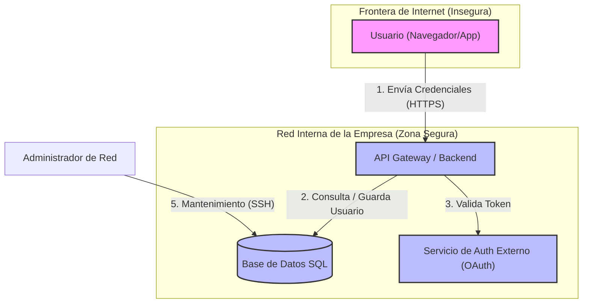

# Modelado de Amenazas: Sistema de Autenticación y API de Usuarios

**Fecha:** 2026-09-10  
**Versión:** 1.0  
**Autores:** [Nicolás Orozco Ibáñez]

## 1. Diagrama de Flujo de Datos (DFD) con Mermaid.js

A continuación se muestra la arquitectura lógica del sistema, los flujos de datos y las fronteras de confianza (Trust Boundaries) que separan las zonas seguras de las inseguras.

## 2. Matriz de Amenazas (Metodología STRIDE)

Para analizar los riesgos en las fronteras de confianza, aplicamos el modelo STRIDE (Spoofing, Tampering, Repudiation, Information Disclosure, Denial of Service, Elevation of Privilege).

| ID | Componente / Flujo afectado | Amenaza (STRIDE) | Descripción del Riesgo | Mitigación Propuesta | Estado |
| :--- | :--- | :--- | :--- | :--- | :--- |
| **T-01** | Flujo 1 (Usuario -> API) | **S**poofing (Suplantación) | Un atacante intercepta la red y suplanta la identidad del usuario enviando credenciales falsas. | Implementar HTTPS obligatorio con TLS 1.3 y cookies seguras (`HttpOnly`, `Secure`). |  Mitigado |
| **T-02** | Flujo 2 (API -> BD) | **T**ampering (Alteración) | El usuario inyecta código malicioso en el formulario de login para alterar la consulta SQL (**SQL Injection**). | Uso estricto de ORM (como Prisma o Sequelize) y consultas preparadas (Prepared Statements). |  Mitigado |
| **T-03** | Componente: Base de Datos | **I**nformation Disclosure | Acceso directo no autorizado a la base de datos que expone las contraseñas de los usuarios. | Encriptar las contraseñas usando **Argon2id** o **bcrypt** antes de guardarlas. Encriptar la BD en reposo. |  Mitigado |
| **T-04** | Flujo 1 (Usuario -> API) | **D**enial of Service | Un botnet inunda la API con millones de peticiones HTTP POST de login, saturando el servidor de red. | Configurar un **Rate Limiter** en el API Gateway (máximo 5 peticiones de login por minuto por IP). |  En Progreso |
| **T-05** | Flujo 5 (Admin -> BD) | **E**levation of Privilege | Un atacante local accede al puerto SSH de la base de datos e intenta adivinar la contraseña por fuerza bruta. | Cerrar el puerto SSH al público (`0.0.0.0/0`). Solo permitir accesos mediante una **VPN** empresarial o Bastion Host. |  Pendiente |

## 3. Lista de Control de Mitigaciones Pendientes (Checklist)

A medida que el equipo de desarrollo escribe el código y configura la red, debe marcar el progreso aquí:
- [x] Configurar TLS 1.3 en el servidor web.
- [x] Implementar hashing de contraseñas con Argon2id.
- [x] Implementar Rate Limiting en la API.
- [x] Configurar las reglas de Firewall (Security Groups) para aislar la Base de Datos.
